<div align="center">

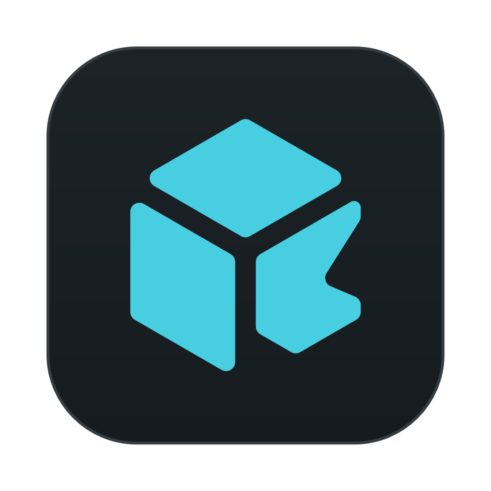

# kubiq

**A desktop Kubernetes console for people who live in one.**

Dense tables you can read at a glance. Live lists that admit when they are stale.
Logs, shells and port forwards in a dock at the bottom. Helm and Argo CD in the same window.
One native application, no browser tab, nothing to install in your cluster.

[](https://github.com/iappx/kubiq/actions/workflows/ci.yml)
[](https://github.com/iappx/kubiq/releases/latest)


[Why](#why-another-kubernetes-console) ·
[What you get](#what-you-get) ·
[A tour](#a-tour) ·
[How it works](#how-it-works) ·
[Keyboard](#keyboard) ·
[Getting started](#getting-started) ·
[Development](#development)

</div>

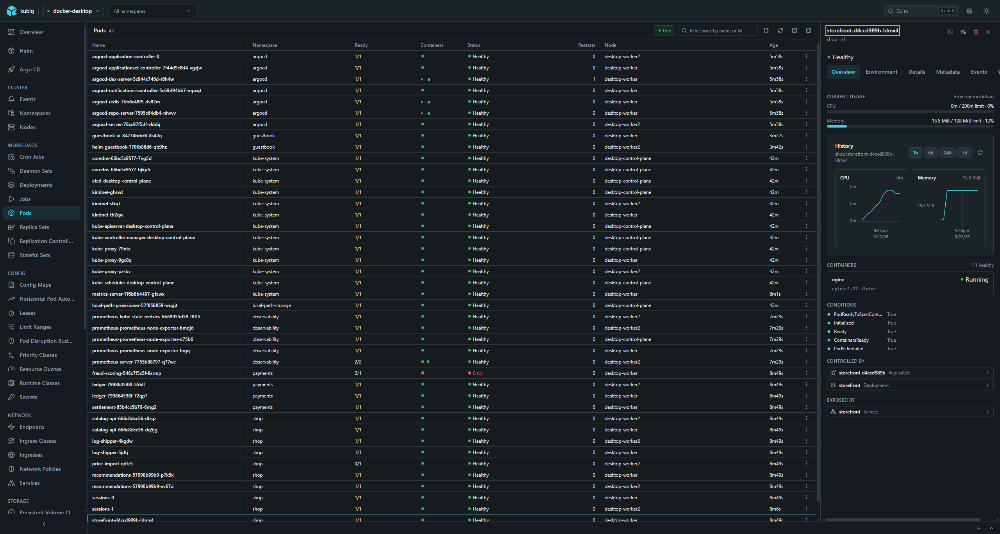

---

## Why another Kubernetes console

Because the job is a loop, and most tools interrupt it.

You are looking for one pod among four hundred. You find it, read the last two hundred lines of
its log, exec in, check a file, restart the rollout, and go back to the list to see whether the
new one came up. That loop is the product. Everything else — the chrome, the animation, the
dashboard nobody asked for — is overhead paid on every visit.

kubiq is built around four decisions:

- **Density over comfort.** Padding spent on whitespace is a row you cannot see. Rows are 28px by
  default, the columns are the ones `kubectl get` prints, and the name comes first.
- **Latency is the feature.** A list that paints in 200 ms beats a list that animates beautifully
  in 600 ms. Lists arrive once and are then kept current by a watch, not by polling.
- **The cluster is the source of truth, not our optimism.** If a watch drops, the list says
  *Stale since 14:07* and offers to reconnect. It never shows you a state nobody confirmed.
- **Quiet chrome.** Colour means status. One accent, hairline borders, two themes that are
  equals rather than a dark one and an afterthought.

If you know Lens, the shape will be familiar on purpose — the catalog as the entry screen,
the grouped sidebar, the dense table, the bottom dock. The muscle memory is worth keeping.
What is different is deliberate: details open in a **non-modal** side panel so the list underneath
stays scrollable and clickable, the sidebar is built from the cluster's **own discovery document**
so there are no dead menu entries, staleness is **stated** rather than hidden, and everything is
reachable from the keyboard.

---

## What you get

|  | |
|---|---|
| **Many clusters, at once** | Every context from `~/.kube/config` and anything on `KUBECONFIG`, plus files you add yourself. Connections are simultaneous; switching is instant because nothing is torn down. |
| **A sidebar the cluster wrote** | Built from `/api`, `/apis` and the CRDs the server actually serves, at each group's preferred version. Custom resources are grouped by API group. A kind the cluster does not serve is not in the menu at all; a kind your role cannot read says which right would open it. |
| **Live lists** | Backed by `watch`. Changes are batched and flushed every 100 ms; reconnects back off from 500 ms to 15 s and survive a laptop going to sleep. A dropped watch is shown, not swallowed. |
| **A detail panel that does not block the list** | Overview, Environment, Details, Metadata, Events and YAML, side by side with the table. Resizable, and the width is remembered. |
| **YAML you can edit and apply** | Monaco, holding the object exactly as the server returned it. **Apply** sends your document, **Revert** throws it away, and the header says whether anything is unsaved. Create new objects from a template the same way. |
| **Object actions** | Scale, restart rollout, trigger a cron job now, cordon, uncordon, drain, delete — with a confirmation that names what it is about to touch. |
| **Logs that read like logs** | Streaming, ANSI colour preserved, per-container, previous container, search with highlighting and match count, show-only-matching, wrap, timestamps, tail size and time window, save to a file or copy. |
| **Three kinds of shell** | `exec` into a container over a WebSocket channel; a node shell — a privileged pod scheduled onto the node you picked and deleted when you close the tab; and a local shell on your own machine, already pointed at the cluster and namespace you are looking at. |
| **Port forwards** | To a pod or a service. The form offers the namespaces, names and declared ports that actually exist, then hands you `127.0.0.1:<port>` and a button to open it. |
| **Metrics** | Current usage from `metrics.k8s.io` as bars against requests and limits, and history from Prometheus — discovered in the cluster or pointed at by hand — for the cluster, a node, a workload or a single pod. |
| **Helm** | Repositories, chart browsing, releases with revision history, values, rendered manifest, notes and the objects a release owns. Install, upgrade, roll back and uninstall with the command's output streamed live. |
| **Argo CD** | Applications, projects and application sets. Sync, refresh, roll back to a revision, toggle automated/prune/self-heal, read resource trees, history and conditions. |
| **Secrets stay secret** | The environment inspector shows where every variable came from and masks anything sourced from a Secret until you reveal it — and a revealed value is never written to a log or a file. |
| **Themes and density** | Light and dark, compact and comfortable, both persisted. Every colour is a token, so rebranding is a stylesheet change. |

---

## A tour

### Start at the catalog

Every context kubiq can see, with its server, its default namespace and the version it answers
with. Pin the ones you use. Click a row and you are inside.

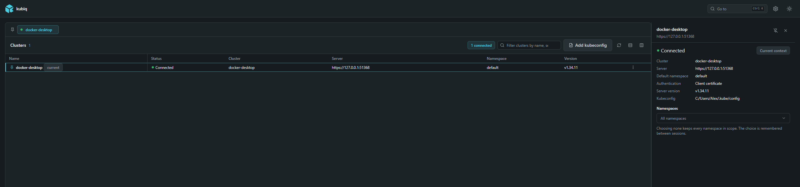

Kubeconfig files are read **where they are** and never copied. Add extra ones from Settings, by
picking a file or by pasting the contents.

### See the whole cluster before you go looking

Counts that say *needs attention* rather than a green tick, current CPU and memory across the
nodes, history if Prometheus is reachable, node health, and the warnings the cluster raised most
recently — the events you would otherwise have gone hunting for.

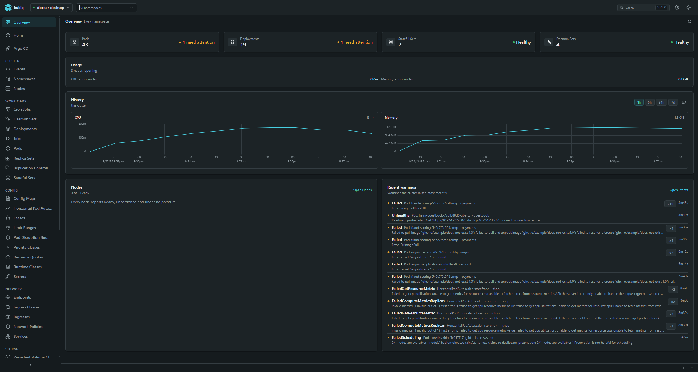

### Then go looking

The list is the tool. Filter by name or label, sort, move the row cursor with the arrow keys,
open with `Enter`, close with `Esc`. The panel on the right stays open while you move between
rows, and it tells you what the object is controlled by and what exposes it — one click to walk
the chain.

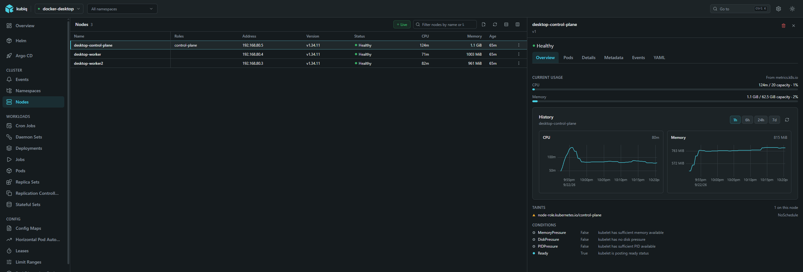

### Logs

Colour comes from the log's own ANSI escapes, not from our guesswork. Search highlights every
match and counts them; *show only matching lines* turns the same query into a filter. Tabs stack
in the dock, so a log, another log and a shell can be open at once.

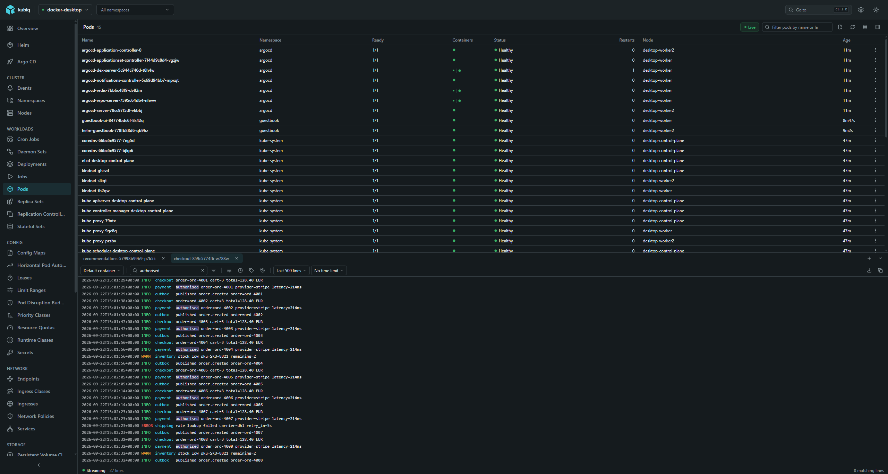

### Shells

A real terminal — `xterm.js` in front, a WebSocket `exec` channel to the API server behind.
Resize it, search the scrollback, switch containers.

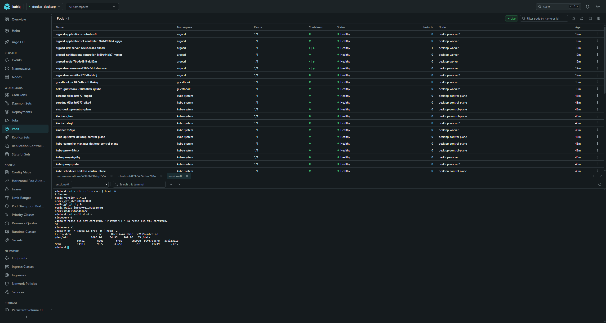

Two more kinds live in the same dock. A **node shell** schedules a privileged pod onto the node
you picked, attaches to it, deletes it when you close the tab — and sweeps up any left behind by
a window that did not get the chance. A **local shell** starts *your* shell on *your* machine with
`KUBECONFIG` already pinned to the cluster and namespace you are looking at, so `kubectl` there
means the same thing as the screen here.

### Port forwards

Pick a pod or a service; kubiq offers the namespaces and names that exist and the ports the
object declares, so there is nothing to mistype. Forwards are listed with the local address they
are bound to and stay up until you stop them.

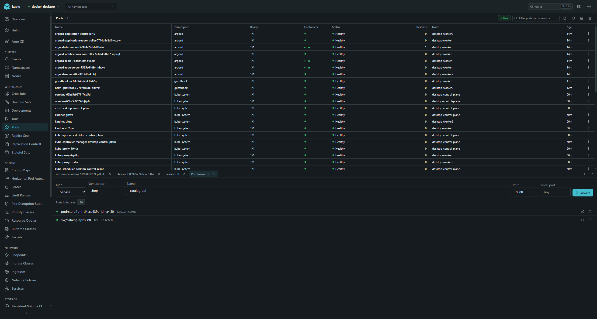

### YAML, and applying it

The object as the server returned it, in Monaco. Change it and **Apply** sends your document;
**Revert** throws it away. The header states whether anything is unsaved, so you always know what
the cluster has and what it does not.

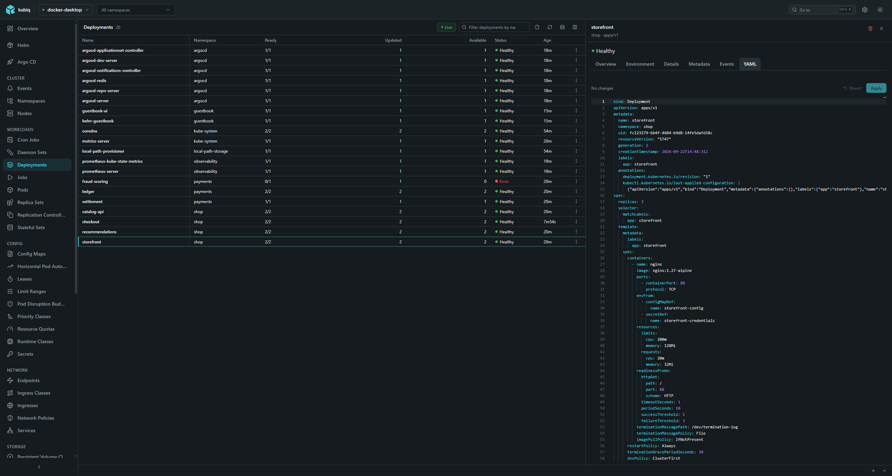

### Environment, without leaking it

Every variable with its origin — literal, ConfigMap key, Secret key, field reference. Values that
came from a Secret are masked until you ask for them, one at a time.

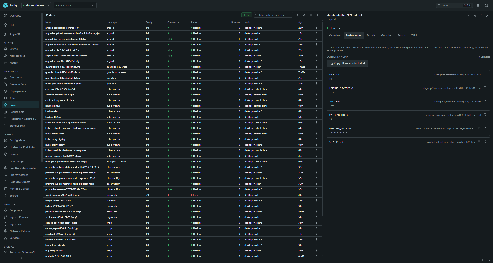

### Helm

Releases across the namespaces in scope, with status, chart and app versions and revision. Open
one for its values, the rendered manifest, its notes, its history and every object it owns.
Install, upgrade, roll back and uninstall run the real `helm` binary and stream its output into
the panel, so you see what you would have seen in a terminal.

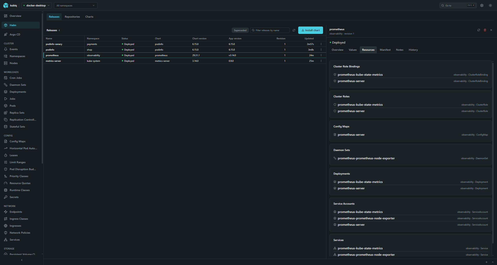

### Argo CD

If the CRDs are there, the section appears. Applications with sync and health at a glance,
projects, application sets, the resource tree, the sync history, and the toggles for automated
sync, prune and self-heal right where you are reading the status.

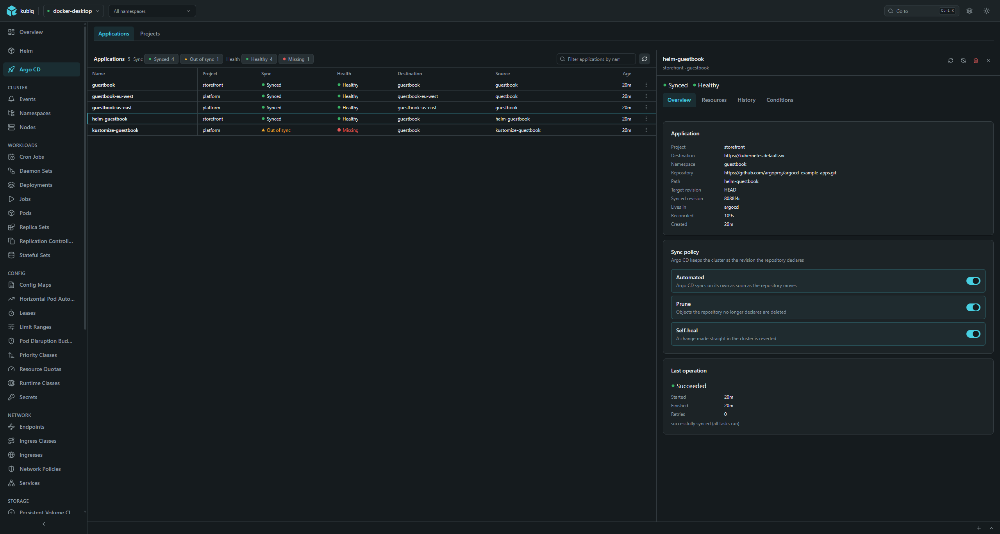

### Jump anywhere

`Ctrl`/`Cmd` + `K` searches kinds, namespaces and clusters together, remembers what you picked
last, and gets out of the way on `Esc`.

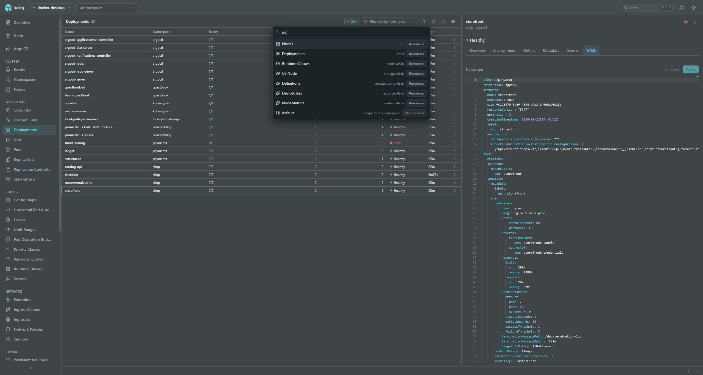

### Make it yours

Theme, density, panel width, the paths to `kubectl` and `helm` if they are not on `PATH`, the
image used for node shells, Prometheus per cluster, and where the settings and the journal live.

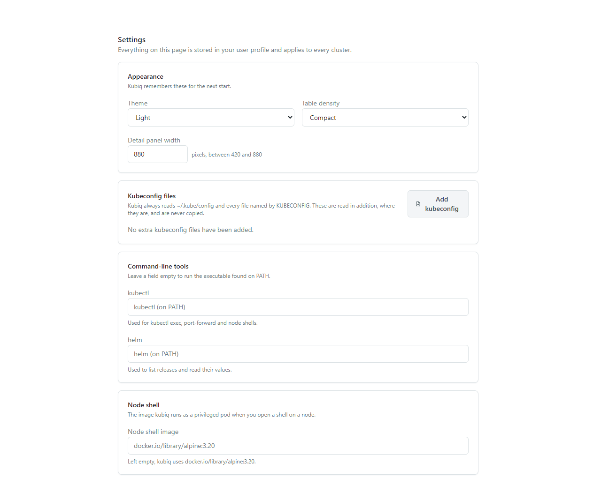

---

## How it works

### One rule: the Go side is a dumb client

The backend is a Wails 3 application that binds eight small services. Not one of them knows a
Kubernetes noun.

| Service | What it does | What it does **not** know |
|---|---|---|
| `kube.ConnectionService` | Builds a TLS client from a flat specification and keeps it in a session registry | What the connection will be used for |
| `kube.KubeService` | `Send(method, path, headers, body)`, plus chunked streams for `watch` and logs | Any API path, any resource, any payload |
| `channel.ChannelService` | WebSocket channels for `exec`/`attach`, and port forwarding | That one carries a shell and the other a database |
| `process.ProcessService` | Runs a child process, with a PTY where the platform has one | `helm`, `kubectl`, or what their output means |
| `io.IoService` | Reads and writes files, with byte ranges | What a kubeconfig is |
| `env.EnvService` | Environment variables, home directory, path expansion | — |
| `storage.StorageService` | A JSON document in the user profile, with migrations | What the document contains |
| `journal.JournalService` | An append-only journal with a whitelist-based redactor | — |

Everything that is *about* Kubernetes — which endpoint, what the payload means, how a response
maps onto entities, what a failure should say — lives in the frontend. Adding an endpoint is a
frontend change: no rebuild of the binary, no regenerated bindings. The Go layer stays small
enough to be obviously correct, and the frontend stays testable by faking a transport.

It also keeps the trust boundary in one place. The frontend hands Go a connection specification
once — server, CA, client certificate and key, or a token — and from then on refers to an opaque
session id. Certificates and tokens never travel back out. The journal redacts URIs before writing
them, because a query string can carry a token.

### The data layer is not a pile of `fetch` calls

Every collection in the application — pods, Helm releases, Argo applications, Prometheus series,
the cluster catalog, your own settings — is an **entity set on a context**, queried through
[`@iappx/entity-repo`](https://github.com/iappx) and its REST and query dialects.

```
entity  →  set on a context  →  query  →  transport  →  the outside world
```

A recurring condition is a **named rule** kept next to the entity, so it is written once and read
like the sentence an operator would say:

```ts
export class PodFilters {
    public static onNode<T>(filter: FilterFactory<T>, nodeName: string): TFilterNode {
        return filter.opPath(QueryOperators.eq, ['spec', 'nodeName'], nodeName)
    }

    public static running<T>(filter: FilterFactory<T>): TFilterNode {
        return filter.opPath(QueryOperators.eq, ['status', 'phase'], 'Running')
    }

    public static runningOnNode<T>(filter: FilterFactory<T>, nodeName: string): TFilterNode {
        return filter.and(PodFilters.onNode(filter, nodeName), PodFilters.running(filter))
    }
}

context.pods.where(f => PodFilters.runningOnNode(f, 'desktop-worker2')).take(500).getAll()
```

The interesting part is what that buys:

- **The Kubernetes API is a dialect, not a fork.** A URL builder, a filter encoder and a response
  adapter teach the REST dialect how the API server spells things: a path under
  `metadata.labels` compiles to a `labelSelector`, anything else to a `fieldSelector`, and paging
  to a `continue` token.
- **A query is checked before it leaves the process.** The encoder declares what the API server
  can actually express — `eq`, `ne`, `in`, `notIn`, conjunction only — and what it cannot: no
  `or`, no `not`, no server-side sorting, no field projection. Ask for one of those and the query
  is rejected here, with a sentence saying why, instead of becoming a `400` you have to decode.
- **The same machinery serves every source.** `metrics.k8s.io` is the same dialect with a
  different response adapter. Prometheus is the same dialect again, routed through the API
  server's service proxy. Helm is a transport that runs the `helm` binary and a query that
  compiles the shared AST into its arguments — which is why the Helm screens look and behave like
  the resource screens.
- **Writes go through the entity.** `create`, `update`, `patch` and `delete` serialise the object
  itself, so read-only and generated fields are handled once, in one place, instead of in every
  call site that ever assembles a request body.

### The sidebar is the cluster's answer, not our guess

On connect, kubiq reads `/api` and `/apis`, resolves the preferred version of every group, pulls
each group's resource list, and reads the CRDs. What comes back becomes the menu: 34 built-in
kinds when the cluster serves them, every custom resource grouped under its API group, and
nothing else. A cluster without Argo CD has no Argo CD section. A cluster without
`metrics.k8s.io` shows no usage bars and says so instead of showing zeros.

When a request is refused, the error names the right that would have allowed it — *“A Role
granting "list" on "pods" in namespace "payments" would allow this.”* — rather than leaving you
with an empty screen to interpret.

### Live, or honest about not being live

A list loads once and is then driven by a `watch` on the resource version it came with. Changes
are coalesced and flushed on a 100 ms tick, so a rollout of two hundred pods repaints once, not
two hundred times. A dropped watch retries with backoff from 500 ms to 15 s; a watch that flaps
three times in a row stops and says so; `410 Gone` restarts from a fresh list; and a machine
coming back from sleep resumes instead of sitting there showing yesterday.

Whatever the outcome, the header says which one it is: **Live**, or **Stale since 14:07** with a
*Reconnect* next to it.

### Failures are business events

A transport turns every failure into a named error — timeout, TLS, unreachable host, refused,
conflict, gone — with a message written for the person reading it and the technical detail kept
behind it. Whoever catches it and cannot recover raises an application event; one handler decides
what the user sees. A blank screen with no explanation is the one outcome that is never allowed.

### What is stored, and where

Nothing leaves your machine. Settings and the journal live in your user profile
(`%AppData%\kubiq` on Windows, `$XDG_CONFIG_HOME/kubiq` on Linux), directories created `0700` and
files `0600`. Kubeconfig files are read in place and never copied, rewritten or uploaded. The
journal redacts before it writes.

---

## Keyboard

| | |
|---|---|
| `Ctrl` / `Cmd` + `K` | Command palette — kinds, namespaces, clusters |
| `Ctrl` / `Cmd` + `\` | Collapse or expand the sidebar |
| `↑` `↓` | Move the row cursor |
| `Home` `End` | Jump to the first or last row |
| `Enter` | Open the row under the cursor |
| `Space` | Select the row; `Shift` extends the selection |
| `Esc` | Close the detail panel, then the dock, then drop the row cursor — inside a field it clears the field first |

---

## Getting started

Every release ships a Windows installer and a plain `.exe`, and for Linux an `amd64` binary with
`.deb` and `.rpm` packages — on the [releases page](https://github.com/iappx/kubiq/releases).

To build it from source you will need
[Go 1.25+](https://go.dev/dl/), [Node 22+](https://nodejs.org/) and the
[Wails 3 CLI](https://v3alpha.wails.io/):

```bash
go install github.com/wailsapp/wails/v3/cmd/wails3@latest
```

Then:

```bash
git clone https://github.com/iappx/kubiq.git && cd kubiq
```

```bash
cp frontend/.env.example frontend/.env && (cd frontend && npm install)
```

```bash
wails3 task bindings
```

```bash
wails3 task dev
```

`wails3 task build` produces a binary for the current OS in `bin/`, and `wails3 task package`
builds the installer — NSIS or MSIX on Windows, AppImage or an nfpm package on Linux.

kubiq needs nothing installed in the cluster, and no CLI to browse one: lists, watches, `exec`,
port forwarding and node shells all speak to the API server directly. Two optional tools widen
what it can do — `helm` powers the Helm section, and `kubectl` is put on the local shell's `PATH`
so the terminal you open there behaves like the one you are used to. Both are found on `PATH`, or
given an explicit path in Settings. Usage needs `metrics-server`; history needs Prometheus.

---

## Under the hood

| Layer | Technology |
|---|---|
| Shell | Wails 3, Go 1.25, system tray, close-to-tray |
| Frontend | Vue 3.5, TypeScript 6, Vite 8 |
| Components | Class based (`@iappx/vue-facing-di`) — `@Component`, `@Prop`, `@VModel`, `@Watch`. No Composition API anywhere |
| DI | `tsyringe` |
| State | Pinia over a project `StoreBase`, domain events on a `mitt` bus |
| Routing | `vue-router` driven by declarative route classes — `@RoutePage`, `@RouteTitle`, `@MenuIncluded` |
| UI | Tailwind 4, reka-ui, `@lucide/vue`, motion-v, Monaco, xterm.js, uPlot |
| Data | `@iappx/entity-repo` + `entity-repo-query` + `entity-repo-rest` |
| Tests | Vitest, mocked only at the bindings boundary |

The frontend is layered `presentation → application → domain` with `application → infrastructure
→ domain`, and the dependencies point inwards only:

```
frontend/src/
├── domain/           entities, the resource registry, discovery, events, errors — no Vue, no DI, no IO
├── application/      use-case services (a folder each), event handlers, validators
├── infrastructure/   entity contexts, transports over the bindings, event bus, adapters
├── store/            Pinia stores
├── components/       Vue components
├── containers/       the application shell
├── views/            pages and their route classes
└── lib/              router, store base, validation, utilities
```

```
core/
├── services/kube/       connection sessions, TLS, generic HTTP, watch and log streams
├── services/channel/    WebSocket channels (exec/attach) and port forwarding
├── services/process/    external processes, streams, PTY
├── services/io/         file operations
├── services/env/        environment, home directory, path expansion
├── services/storage/    the user-profile document and its migrations
├── services/journal/    the redacting application journal
└── tray/                system tray and close-to-tray
```

**Quality gates.** 2,438 frontend tests across 224 spec files, plus the Go suite. Tests mock at
the boundary — the generated bindings, or a transport — never the unit under test, because a test
that mocks the thing it is checking proves nothing.

---

## Development

| Command | What it does |
|---|---|
| `wails3 task dev` | Run the app with hot reload |
| `wails3 task build` | Build for the current OS |
| `wails3 task package` | Production build with packaging |
| `wails3 task bindings` | Regenerate the TypeScript bindings after a Go signature changes |
| `go build ./core/... .` | Build the Go side |
| `go vet ./core/...` · `go test ./core/...` | Analyse and test the Go side |
| `npm test` · `npm run typecheck` · `npm run lint` | From `frontend/` |
| `bash .github/scripts/version.sh set 1.4.0` | Write a new version into every file that carries one |

> `go build ./...` also compiles `build/ios`, which needs an iOS toolchain — use
> `go build ./core/... .`.

Application identity — name, company, description, identifier — lives in `build/config.yml`; run
`wails3 task common:update:build-assets` after editing it. The display name is `VITE_APP_NAME` in
`frontend/.env`, and the palette is the `--primary` / `--accent` / `--ring` tokens in
`frontend/src/assets/styles/css/index.css`.

**Releases.** The version is the `VERSION` file at the root, and nine build files repeat it —
`build/config.yml`, the Windows resource, installer and MSIX manifests, the nfpm config and
`package.json` with its lock. `.github/scripts/version.sh set <x.y.z>` writes all of them at once
and `… check` fails the build when they disagree. Pushing a changed `VERSION` to `main` runs
[the release workflow](.github/workflows/release.yml): it builds Windows and Linux on GitHub
runners, attaches the artifacts to a draft release, and publishing that draft is what creates the
`v<VERSION>` tag. Every other push and pull request runs
[the checks](.github/workflows/ci.yml) — the Go suite on Windows and Linux, and the frontend's
lint, types, tests and bundle.

The rules every change in this repository follows are in [CLAUDE.md](CLAUDE.md); the interface
brief every screen follows is in [.ai/ui-ux.md](.ai/ui-ux.md).

---

## Status

Early, and honest about it: the version is `0.0.1` and Wails 3 is itself in alpha. What is in the
tour above is what works today, against real clusters — every screenshot on this page was taken
from the running application.

<div align="center">
<sub>Built by <a href="https://github.com/iappx">IAPPX</a>.</sub>
</div>
